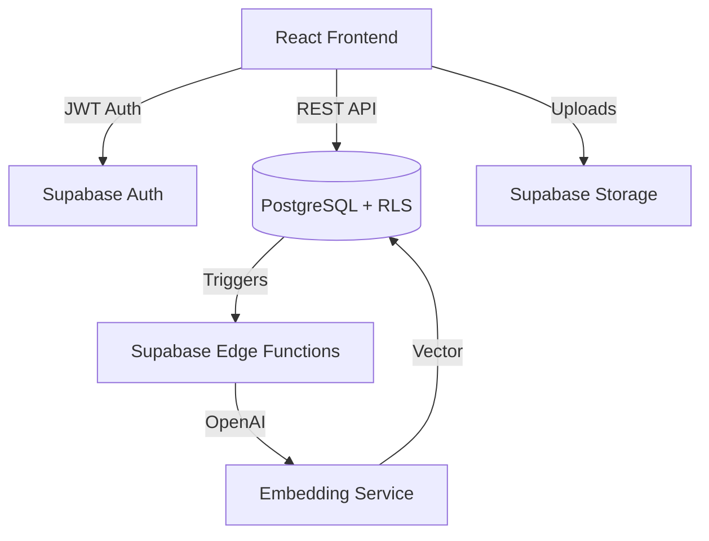

# ⚙️ Technical Design Record: Projecxy v1.1.0

**Version:** 1.1.0 (Architectural Edition)  
**Status:** Implementation Ready  
**Architect:** Antigravity (Senior System Architect)  
**Stack:** React.js / Supabase / PostgreSQL

---

## 1. System Architecture Overview
Projecxy is built on a **Severless BaaS (Backend-as-a-Service)** model, minimizing infrastructure overhead while maximizing scalability and security.

### 1.1 High-Level Component Stack
- **Frontend (Application Layer):** React 18 SPA (Vite/CRA), Tailwind CSS, React Query.
- **Backend (BaaS Layer):** 
    - **GoTrue (Auth):** Handles JWT generation and identity management.
    - **PostgREST (API):** Generates RESTful endpoints automatically from the schema.
    - **Realtime (CDC):** Provides WebSocket updates for notifications and team chat.
- **Database (Data Layer):** PostgreSQL with `pgvector` for semantic search.
- **Storage (Asset Layer):** Supabase/S3 Storage with signed URL access.

---

## 2. Database Schema (Normalized)

### 2.1 Core Identity
- **`departments`**: `id` (uuid), `name` (text), `code` (text), `head_id` (uuid).
- **`profiles`**: `id` (uuid, FK auth.users), `full_name` (text), `role` (enum: student, lead, mentor, faculty, admin), `department_id` (uuid).

### 2.2 Project Management
- **`projects`**: 
    - `id` (uuid), `title` (text), `abstract` (text), `status` (enum: pending, recruiting, in_progress, completed, rejected).
    - `department_id` (uuid), `created_by` (uuid), `tags` (text[]).
    - `embedding` (vector(1536)): For AI duplicate detection.
- **`project_members`**: `id`, `project_id`, `user_id`, `role_in_team` (text).
- **`join_requests`**: `id`, `project_id`, `user_id`, `status` (enum), `message` (text).

### 2.3 Progress & Evaluation
- **`milestones`**: `id`, `project_id`, `title`, `description`, `status` (pending, approved), `file_url`, `feedback` (text).
- **`evaluation`**: `id`, `project_id`, `faculty_id`, `score` (int), `comments` (text), `final_grade` (text).

---

## 3. Data Flow & Life Cycle

1.  **Phase 1: Proposal:** `Student` -> `Create Project (status: pending)`.
2.  **Phase 2: Governance:** `DB Trigger` -> `Edge Function (Duplicate Check)`. If `Similarity < 0.85`, notify `Dept Admin`.
3.  **Phase 3: Recruitment:** `Dept Admin` -> `Approve`. Project status moves to `recruiting`. `Team Lead` opens slots in `project_members`.
4.  **Phase 4: Progress:** `Team Members` -> `Submit Milestone`. `Faculty` -> `Approve Milestone`.
5.  **Phase 5: Completion:** `Team Lead` -> `Final Submit`. `Faculty` -> `Score & Close`.

---

## 4. Logical API Structure (PostgREST + RPCs)

While Supabase provides direct UI-to-DB access, specific complex logic is abstracted via **PostgreSQL Functions (RPCs)**:

| Endpoint (RPC/Table) | Action | Required Role | Logic |
| :--- | :--- | :--- | :--- |
| `GET /projects` | View Projects | Authenticated | RLS filters by department. |
| `POST /rpc/propose_project` | Create | student | Checks for title duplicate + creates member entry. |
| `POST /rpc/check_duplicates` | AI Check | system | Calls Edge function for vector similarity. |
| `PATCH /projects/:id` | Approval | dept_admin | Status change to 'recruiting'. |
| `POST /join_requests` | Apply | student | Creates pending entry. |

---

## 5. Security Design (Zero-Trust RBAC)

### 5.1 Row Level Security (RLS) Policies
- **Projects Visibility:** 
    - `All authenticated` can SELECT `projects` where `status = 'recruiting'`.
    - `Project Members` can SELECT/UPDATE their own project where `status = 'in_progress'`.
- **Submission Access:** 
    - `Faculty` can SELECT `milestones` where `department_id = faculty.department_id`.

### 5.2 Storage Bucket Policies
- **`submissions/`**: 
    - Policy: `allow read/write if project_id in user.project_ids`.
- **`public_portfolios/`**:
    - Policy: `allow select for all; allow insert for project_lead`.

---

## 6. Scalability & Resilience Plan
- **Multi-Tenancy:** Each college/department is logically isolated via `department_id`. As the platform grows to a SaaS model, we will use **Database Schemas** or **Row-Level Partitioning** by `tenant_id`.
- **Database Indexing:**
    - GIN indexes on `tags` and `title` (Full Text Search).
    - HNSW (Hierarchical Navigable Small World) index on `embedding` for fast vector retrieval.
- **Failover:** Multi-Region Read Replicas (Supabase Pro) and daily point-in-time recovery (PITR).
- **Caching:** React Query (Frontend) handles client-side caching of project lists to reduce DB hits.
